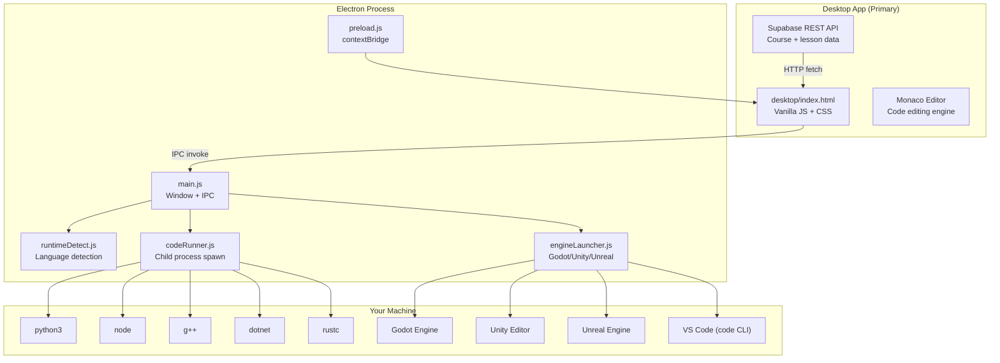
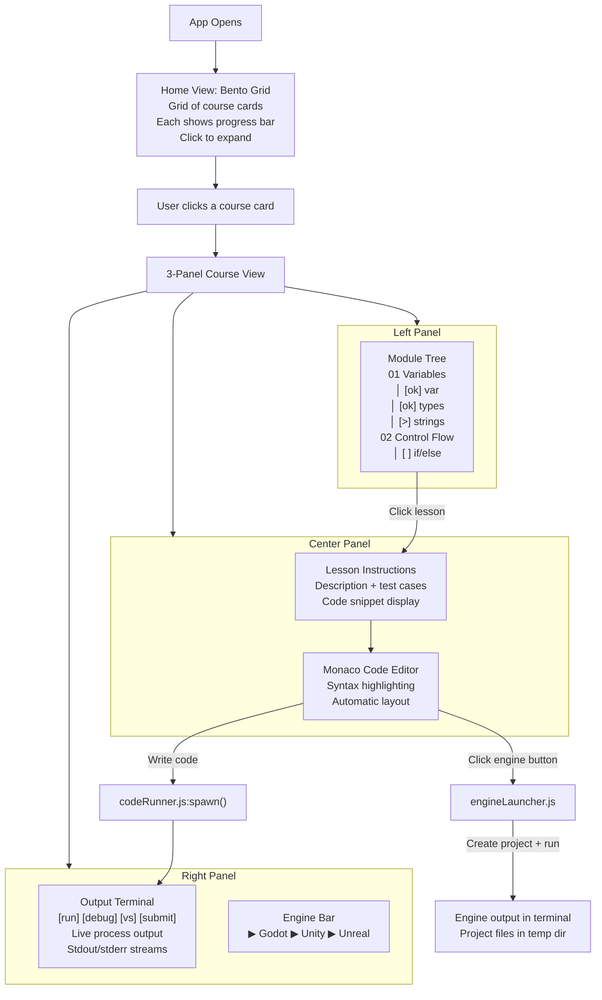
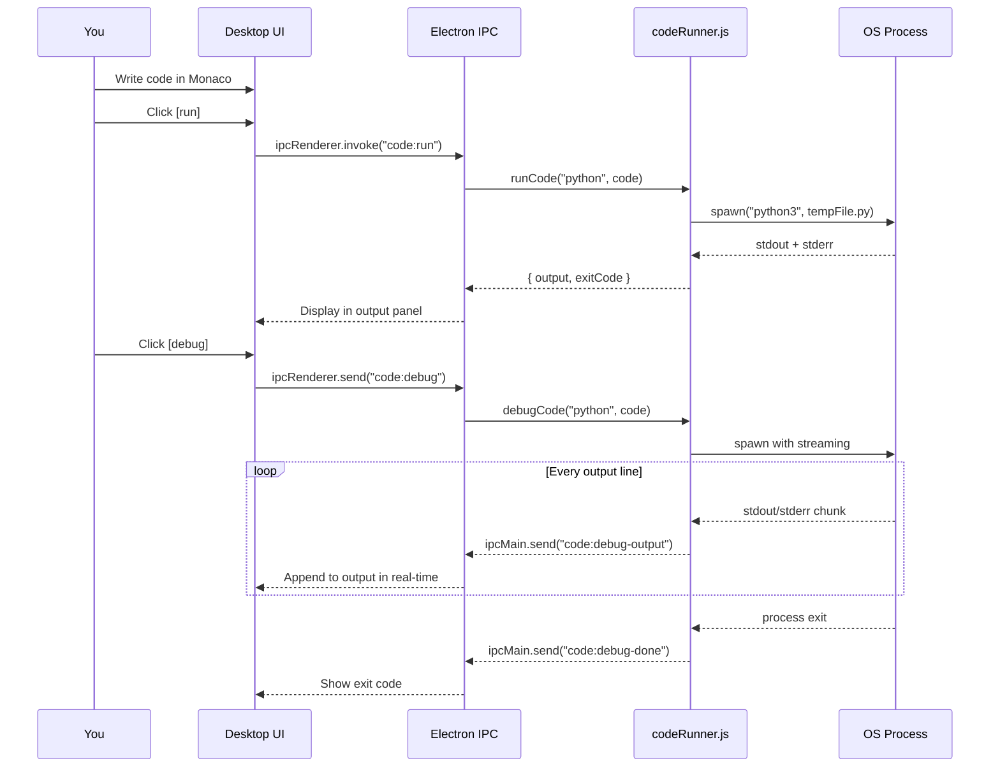
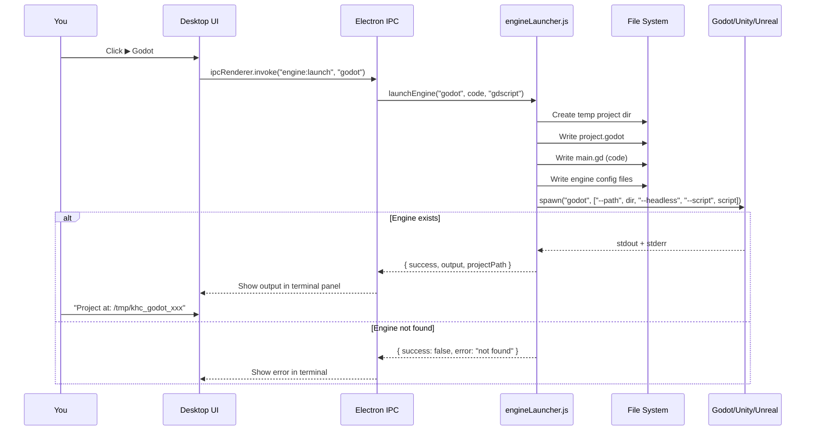
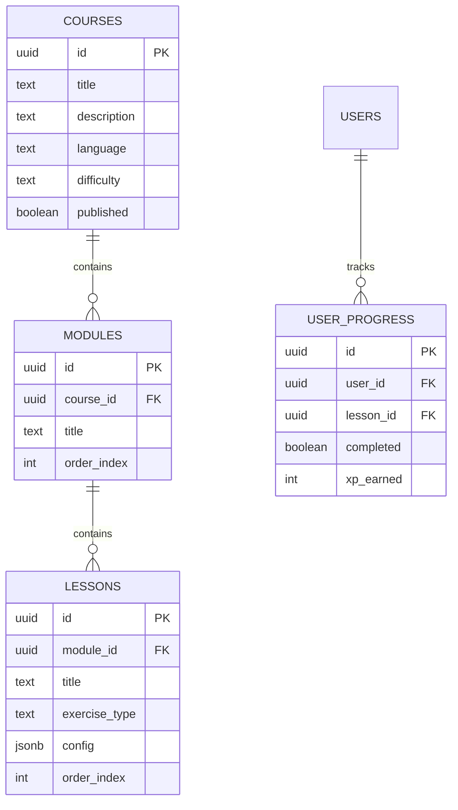

```
  _  ___     _ _           ____          _
 | |/ (_) __| | |__  _ __ / ___|___   __| | ___
 | ' /| |/ _` | '_ \| '__| |   / _ \ / _` |/ _ \
 | . \| | (_| | | | | |  | |__| (_) | (_| |  __/
 |_|\_\_|\__,_|_| |_|_|   \____\___/ \__,_|\___|
```

**Learn every programming language. Master every concept. For free. Forever.**
*...now with a proper desktop app, a VS Code extension, and the ability to launch Godot/Unity/Unreal projects from your exercises because why the hell not.*

---

## Wait, What Is This?

KidhrCode is a **free, open-source, gamified programming learning platform** that covers **17+ programming languages**, with a **3-panel desktop UI** inspired by IDE bento box layouts. It lets you **run code locally**, launch **Godot/Unity/Unreal Engine projects**, open code in **VS Code**, track your **XP and streaks**, and earn **certificates**.

It's like Duolingo for code, but with:
- Zero owls threatening your family
- A real Monaco code editor with syntax highlighting
- The ability to launch a Unity project from a C# exercise
- A terminal aesthetic that makes you feel like you're in a 90s cyberpunk movie

---

## Features

### Desktop App (Primary)
```
┌──────────────────────────────────────────────────────────────────┐
│ [> kidhrcode] courses/Python 101               === 3d  +250 xp  │
├────────────────┬──────────────────────────┬─────────────────────┤
│   MODULES      │  LESSON + CODE EDITOR    │     OUTPUT           │
│                │                          │                     │
│ 01 Variables   │  "Write Hello World"     │  [run] [debug]       │
│  [ok] var      │  ┌──────────────────┐    │  [ vs ] [submit]    │
│  [ok] types    │  │  MONACO EDITOR   │    │                     │
│  [>] strings   │  │  (syntax hl,     │    │  $ python3 run...   │
│  [ ] numbers   │  │  intellisense)   │    │  Hello World        │
│                │  └──────────────────┘    │                     │
│ 02 Control     │  Test cases:             │  ▶ Godot ▶ Unity   │
│  [ ] if/else   │  [1] in:Hello expected:H │  ▶ Unreal           │
├────────────────┴──────────────────────────┴─────────────────────┤
│ [ok] All tests passed!  +25 XP                                  │
└──────────────────────────────────────────────────────────────────┘
```

- **Bento grid home** — course cards with progress bars, click to expand
- **3-panel layout** — left: module/lesson tree | center: Monaco editor + instructions | right: output + run controls
- **Resizable dividers** — drag to resize, collapse panels, restore buttons
- **Monaco Editor** — the same editor engine that powers VS Code, with syntax highlighting for all 17 languages
- **Two execution modes**:
  - `[run]` — execute locally, see final output
  - `[debug]` — live streaming output with real-time process output
- **Auto-detects** installed runtimes — Python, Node.js, C++, C#, Rust, Go, Java, Ruby, PHP, Bash, Dart
- **No internet required** for code execution (local spawns only)

### Game Engine Integration
| Engine | What Happens | Requires |
|---|---|---|
| **Godot** | Creates `project.godot` + GDScript file, runs headless `godot --script` | `godot` CLI installed |
| **Unity** | Creates Unity project with C# script + Assembly-CSharp, launches `Unity -batchmode` | Unity Editor installed at default path |
| **Unreal** | Creates `.uproject` with C++ source + build rules, launches `UnrealEditor-Cmd` | Unreal Engine 5.x installed at default path |
| **VS Code** | Writes code to temp file, opens via `code` CLI | `code` command in PATH |

Each engine button detects whether the engine is installed and grays out if missing.

### VS Code Extension
- Browse courses directly in the VS Code sidebar
- Open lessons in a webview panel
- Run exercises using VS Code's built-in terminal
- Progress syncs back to Supabase

### Web & Mobile (Legacy — still works)
- Progressive Web App via Expo web build
- Android APK for sideloading
- Falls back to Piston API for code execution

### Gamification
- XP per exercise, streaks with multipliers (up to 2x)
- Levels, ranks (Novice → Legend), badges
- Certificates with LinkedIn sharing for completed courses

---

## Architecture

### System Overview



### Bento Box Course Layout Flow



### Code Execution Flow



### Game Engine Launch Flow



---

## Project Structure

```
KidhrCode/
├── desktop/                          # *** PRIMARY: Desktop frontend ***
│   ├── index.html                    # Main layout (bento grid + 3-panel)
│   └── ui/
│       ├── style.css                 # Full dark theme CSS
│       └── app.js                    # All frontend logic (Monaco, IPC, routing)
├── electron/                         # Electron backend
│   ├── main.js                       # Main process (window, IPC handlers)
│   ├── preload.js                    # contextBridge (safe API exposure)
│   ├── runtimeDetect.js              # Detect 12 language runtimes
│   ├── codeRunner.js                 # Spawn processes (run + debug)
│   └── engineLauncher.js             # *** NEW: Godot/Unity/Unreal project launcher ***
├── app/                              # Expo mobile/web screens (legacy)
├── lib/                              # Shared utilities (Supabase, gamification)
├── components/                       # Shared React components
├── vscode-kidhrcode/                 # VS Code extension (companion)
├── supabase/                         # DB schema + seed data
├── scripts/                          # Seed scripts
├── package.json                      # electron-builder config for installers
└── README.md                         # This file
```

---

## How the Integration Works

### Language Runtime Detection

When the app starts, `runtimeDetect.js` runs these commands:

| Language | Detection Command | Runs Code Via |
|---|---|---|
| Python | `python3 --version` / `python --version` | `python3 file.py` |
| JavaScript | `node --version` | `node file.js` |
| TypeScript | `npx tsc --version` | `npx tsx file.ts` |
| C++ | `g++ --version` | `g++ file.cpp -o out && ./out` |
| C# | `dotnet --version` | `dotnet script file.cs` |
| Rust | `rustc --version` | `rustc file.rs -o out && ./out` |
| Go | `go version` | `go run file.go` |
| Java | `java -version` | `javac file.java && java File` |
| Ruby | `ruby --version` | `ruby file.rb` |
| PHP | `php --version` | `php file.php` |
| Bash | `bash --version` | `bash file.sh` |
| Dart | `dart --version` | `dart run file.dart` |

Results are cached and displayed in the footer of the home view. Missing runtimes are grayed out.

### Game Engine Integration (Deep Dive)

Each engine gets its own project generator in `electron/engineLauncher.js`:

**Godot:**
```
/tmp/khc_godot_1678901234/
├── project.godot         # [application] config/name, run/main_scene
└── main.gd               # The user's GDScript code
```
Runs: `godot --path /tmp/khc_godot_xxx --headless --script main.gd`

**Unity:**
```
/tmp/khc_unity_1678901234/
├── Assets/
│   ├── Exercise.cs        # The user's C# code
│   └── Assembly-CSharp.csproj  # netstandard2.1 target
└── ProjectSettings/       # Auto-generated by Unity
```
Runs: `Unity -projectPath /tmp/khc_unity_xxx -batchmode -quit -executeMethod ExerciseRunner.Run`

**Unreal Engine:**
```
/tmp/khc_unreal_1678901234/
├── KidhrCode.uproject     # JSON project descriptor (EngineAssociation: 5.3)
├── Source/
│   └── KidhrCode/
│       ├── Exercise.cpp   # The user's C++ code
│       └── KidhrCode.Target.cs  # Build rules
```
Runs: `UnrealEditor-Cmd.exe /tmp/khc_unreal_xxx/KidhrCode.uproject -RunTest`

Each detects the engine at the default install path for the current OS. If not found, the button is grayed out with a `missing` class.

### Monaco Editor

The editor is loaded from CDN and initialized with a custom `khc-dark` theme matching the app's terminal aesthetic:

```js
monaco.editor.defineTheme('khc-dark', {
  base: 'vs-dark',
  colors: {
    'editor.background': '#000000',
    'editor.foreground': '#D0D0D0',
    'editorCursor.foreground': '#3FB950',
  },
});
```

Language mapping converts KidhrCode language names to Monaco language IDs:
`python` → `python`, `gdscript` → `python`, `cpp` → `cpp`, etc.

---

## Quick Start

### Prerequisites
- Node.js 18+
- npm
- A Supabase account (free tier)

### 1. Clone & Install
```bash
git clone https://github.com/0giinn0/KidhrCode.git
cd KidhrCode
npm install
```

### 2. Run Desktop App
```bash
npm run electron
```

### 3. Build Installers
```bash
# All platforms
npm run electron:build

# Windows only (NSIS installer + portable)
npm run electron:build:win

# macOS only (DMG)
npm run electron:build:mac

# Linux only (AppImage + deb)
npm run electron:build:linux
```

### VS Code Extension (Companion)
```bash
cd vscode-kidhrcode
npm install
npm run package   # produces kidhrcode-1.0.0.vsix
# Install: Extensions → Install from VSIX
```

---

## Supporting Game Engines

To use the engine launch buttons, install the corresponding engine:

- **Godot**: Download from [godotengine.org](https://godotengine.org), add `godot` to PATH
- **Unity**: Install via Unity Hub (default path: `C:\Program Files\Unity\Hub\Editor\2022.3\Editor\Unity.exe`)
- **Unreal**: Install via Epic Games Launcher (default path: `C:\Program Files\Epic Games\UE_5.3\Engine\Binaries\Win64\UnrealEditor-Cmd.exe`)

---

## Database Schema



---

## Gamification

```
Base XP:  beginner=10  easy=25  medium=50  hard=100  expert=200
Streak:   3d→1.2x  7d→1.5x  14d→1.8x  30d→2.0x
Level:    floor(sqrt(totalXp/100)) + 1
Ranks:    Novice(0) → Coder(1k) → Developer(5k) → Engineer(15k) → Architect(35k) → Legend(70k)
```

---

## License

MIT — free to use, modify, and distribute.

---

## Built With

- **Desktop UI**: Vanilla HTML/CSS/JS + Monaco Editor
- **Desktop Runtime**: Electron
- **Backend**: Supabase (PostgreSQL + REST API)
- **Code Execution**: Local child_process spawn (Piston API as fallback on web)
- **Game Engines**: Godot, Unity, Unreal Engine (detected and launched locally)
- **Mobile/Web (legacy)**: Expo + React Native
- **VS Code Extension**: TypeScript + VS Code API
