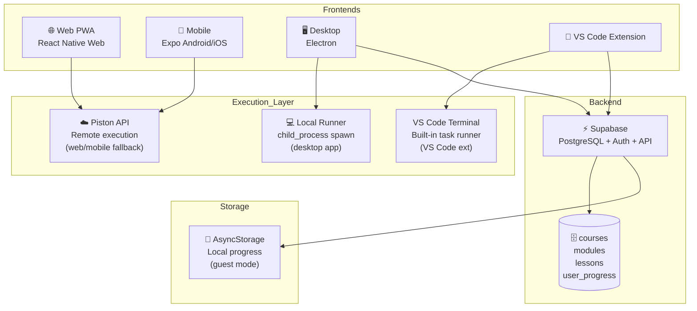
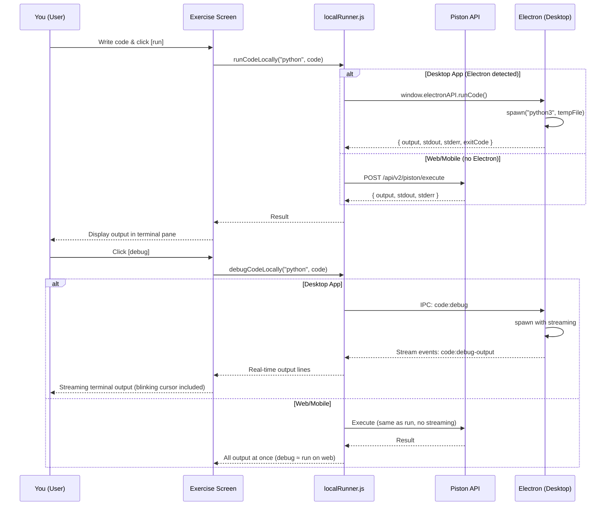
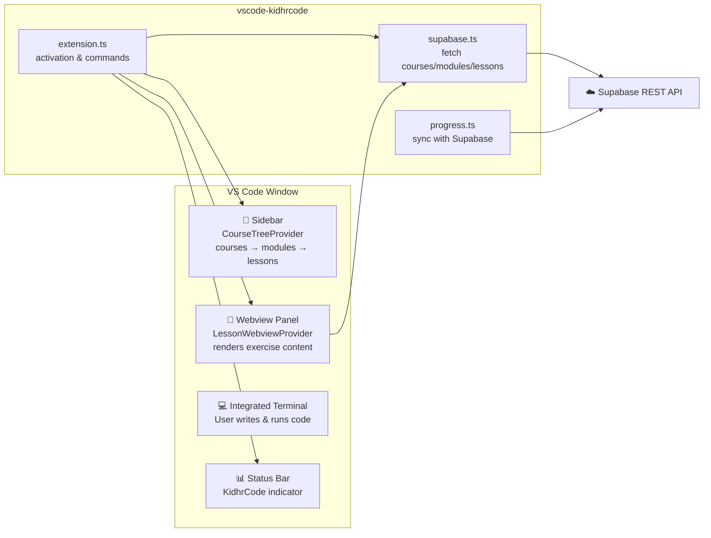
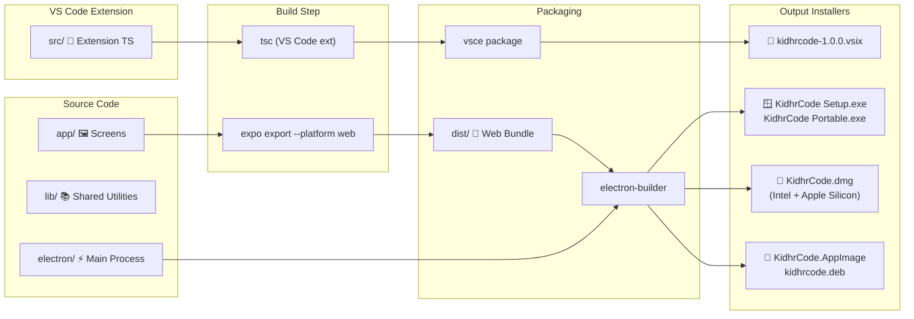
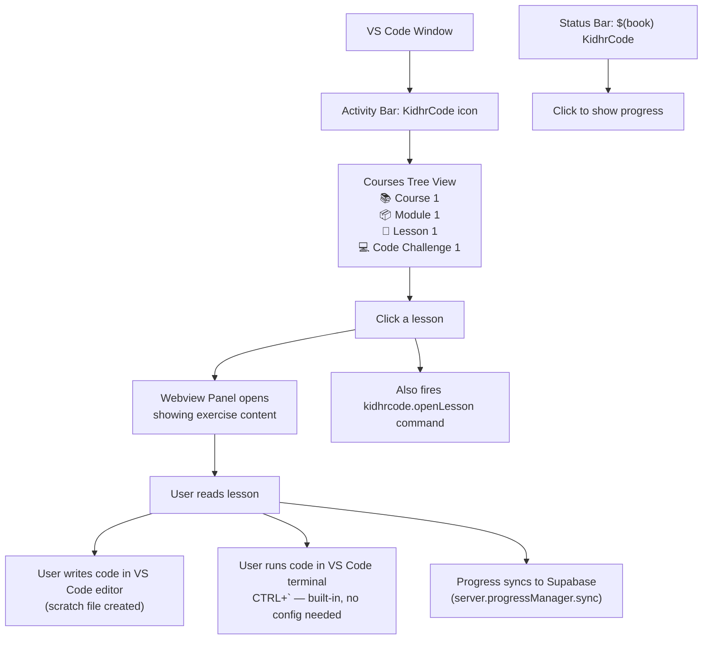
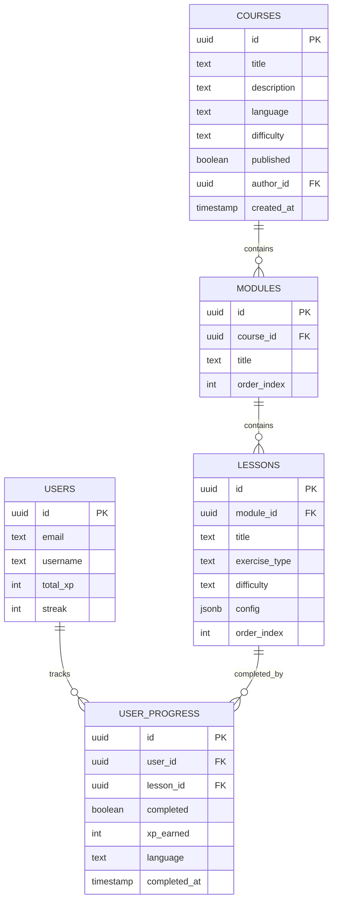

# 💻 KidhrCode

```


     _    _ _     _           ____      _      
    / \  | (_) __| |_ __ ___ |  _ \ ___| |___
   / _ \ | | |/ _` | '__/ __|| |_) / __| / __|
  / ___ \| | | (_| | | | (__ |  _ < (__| \__ \
 /_/   \_\_|_|\__,_|_|  \___||_| \_\___|_|___/
                                               
```


**Learn every programming language. Master every concept. For free. Forever.**
*...and now also on your desktop with real local code execution and a VS Code extension because apparently one platform wasn't enough.*

> "I understood the reference." — Captain America, probably, about this README

---

## 🎯 Wait, What Is This?

KidhrCode is a **free, open-source, gamified programming learning platform** that covers **17+ programming languages**, lets you **run code locally** on your actual machine (not some fake sandbox), has a **VS Code extension** so you never have to leave your precious editor, a **web PWA** for the heathens who browse, and an **Android APK** for... okay, that one's just because we could.

It's like Duolingo for code, but with:
- Fewer cartoon owls threatening your family
- Actual real code execution
- A terminal aesthetic that makes you feel like a hacker from a 90s movie
- The ability to run code **on your actual computer** like a goddamn adult

---

## ✨ Features (The Bullet Point Variety)

### 🖥️ Desktop App (Electron — NEW)
- Cross-platform: Windows (.exe/.msi), macOS (.dmg), Linux (.AppImage/.deb)
- **Local code execution** — runs Python, Node.js, C++, C#, Rust, Go, Java, and more ***on your machine***
- **Two execution modes**:
  - `[run]` — Execute code, see final output (like Piston but local, like your self-esteem: local)
  - `[debug]` — Live streaming output as the process runs, because watching paint dry is also a valid hobby
- Auto-detects installed language runtimes and shows you what you've got
- No internet required for code execution once courses are loaded (take that, Piston API)

### 🔌 VS Code Extension (NEW)
- Browse courses directly in the VS Code sidebar (yes, inside the thing you already live in)
- Open lessons in a webview panel with full course content
- Run exercises using VS Code's built-in terminal (no runtime detection needed — VS Code already runs everything)
- Progress syncs back to Supabase (same account, same streak, same bragging rights)
- Refresh button to feel like you're doing something productive

### 🌐 Web & 📱 Mobile (Still Here, Still Free)
- Progressive Web App — installable on any device
- Android APK for sideloading (because Play Store is a walled garden and we're rebellious like that)
- iOS via browser (Apple wants $99/year for the privilege of putting apps on their devices, we said nah)
- Falls back to Piston API for code execution when you're not in the desktop app

### 🎓 Learning (The Core Thing)
- 19 courses covering 17+ languages from Python to C++ to AI Prompt Engineering
- Project-based workalong courses — you build real things, step by step
- 16 exercise types: multiple choice, code challenges, debugging, Parsons problems, output prediction, and more
- Community course creation — anyone can build and publish courses

### 🏆 Gamification (The Addictive Thing)
- XP, levels, streaks, ranks, badges — all the dopamine, none of the owl
- Daily login streaks with XP multipliers up to 2x (for the 30-day streak psychos)
- Leaderboards: daily, weekly, monthly, all-time
- Ranks: Novice → Coder → Developer → Engineer → Architect → Legend
- Certificates with LinkedIn sharing for completed courses (print it, frame it, impress your mom)

---

## 📊 Architecture (The Diagrams You Were Promised)

### System Overview



### Code Execution Flow (How Your Code Actually Runs)



### VS Code Extension Architecture



### Build Pipeline (How to Get Installers)



---

## 🚀 Quick Start (Because You're Impatient)

### Prerequisites
- Node.js 18+ (you have this, right? right??)
- npm or yarn (pick a lane)
- A Supabase account (free tier, we're broke too)
- Python 3.x (if you want to actually run Python locally, revolutionary concept)

### 1. Clone & Install
```bash
git clone https://github.com/0giinn0/KidhrCode.git
cd KidhrCode
npm install
```

### 2. Set Up Supabase
1. Create a Supabase project at [supabase.com](https://supabase.com) (it's free, calm down)
2. Go to **SQL Editor** and run `supabase/schema.sql` to create all tables
3. Run `supabase/seed-full.sql` to get all 19 courses (or `supabase/seed.sql` for the starter 2)
4. Go to **Project Settings → API** and copy your URL and anon key
5. Open `lib/constants.js` and paste them in like you're defusing a bomb

### 3. Run Web/Mobile (The Old Way)
```bash
npm run web
# or
npm run android
```

### 4. Run Desktop App (The New Hotness)
```bash
# Development mode (starts Expo + Electron together)
npm run electron:dev

# Production build (creates installers)
npm run electron:build
```

### 5. VS Code Extension
```bash
cd ../vscode-kidhrcode
npm install
npm run package   # creates .vsix
# Install in VS Code: Extensions → ... → Install from VSIX
```

---

## 🏗️ Project Structure (What Goes Where)

```
KidhrCode/                          # Main project root
├── app/                            # Expo Router screens
│   ├── _layout.tsx                 # Root layout — redirects to tabs immediately
│   ├── (tabs)/                     # Main app with bottom tab navigation
│   │   ├── index.tsx               # Home — course catalog, stats, guest banner
│   │   ├── courses.tsx             # All courses with search + language filter
│   │   ├── leaderboard.tsx         # Rankings (daily/weekly/monthly/all-time)
│   │   └── profile.tsx             # Profile, stats, badges, sync local progress
│   ├── auth/                       # Login & signup (modal)
│   ├── course/[id].tsx             # Course detail with modules + lessons tree
│   ├── exercise/[id].tsx           # Exercise player — 16 types, run/debug buttons
│   ├── certificate/                # Certificate generation + LinkedIn sharing
│   ├── creator/                    # Course builder studio (create, edit, publish)
│   └── admin/                      # Admin dashboard
├── electron/                       # *** NEW: Electron desktop app ***
│   ├── main.js                     # Main process — BrowserWindow + IPC setup
│   ├── preload.js                  # contextBridge — safe API for renderer
│   ├── runtimeDetect.js            # Detects installed language runtimes
│   └── codeRunner.js               # Spawns processes: run + debug modes
├── lib/
│   ├── supabase.js                 # Supabase client (you know, the DB)
│   ├── piston.js                   # Piston API integration (remote code exec)
│   ├── localRunner.js              # *** NEW: Unified API — Electron local or Piston fallback ***
│   ├── runtimeDetect.js            # *** NEW: Shared runtime detection ***
│   ├── localProgress.js            # AsyncStorage-based offline progress
│   ├── gamification.js             # XP, levels, ranks, streaks, badges
│   └── constants.js                # Colors, env vars, icons, exercise types
├── components/
│   └── Terminal.js                 # Shared terminal-themed UI components
├── supabase/
│   ├── schema.sql                  # Full DB schema (tables, RLS, triggers)
│   ├── seed.sql                    # Starter courses (Python 101 + JS Basics)
│   └── seed-full.sql               # All 19 courses
├── scripts/
│   └── seed-courses.mjs            # Programmatic seeder (Node.js)
├── dist/                           # Web export output (loaded by Electron in prod)
├── public/                         # PWA icons + manifest
├── package.json                    # Dependencies + build scripts + electron-builder config
├── app.json                        # Expo config
└── README.md                       # This masterpiece you're reading

vscode-kidhrcode/                   # *** NEW: VS Code Extension ***
├── package.json                    # Extension manifest + vsce config
├── tsconfig.json                   # TypeScript config (strict, because we're professionals)
├── .vscodeignore                   # What NOT to bundle in the .vsix
├── src/
│   ├── extension.ts                # Activation, deactivation, command registration
│   ├── courseTreeProvider.ts        # Tree view — courses → modules → lessons
│   ├── webviewProvider.ts           # Webview panel for exercise content
│   ├── supabase.ts                  # Supabase client + types (duplicated for isolation)
│   └── progress.ts                  # Progress sync + status bar
└── media/                          # Extension icons
```

---

## 🎮 How the Desktop App Works (The Interesting Part)

### The "I Don't Want to Read" Summary

```mermaid
graph TB
    START["User opens KidhrCode Desktop"] --> DETECT["runtimeDetect.js<br/>Scans for installed languages<br/>(python3 --version, node --version, etc.)"]
    DETECT --> COURSES["Course list loads from Supabase"]
    COURSES --> EXERCISE["User opens a code challenge"]

    EXERCISE --> CHOICE{"Which button?"}
    CHOICE -->|[run]| RUN["lib/localRunner.js<br/>runCodeLocally()"]
    CHOICE -->|[debug]| DEBUG["lib/localRunner.js<br/>debugCodeLocally()"]
    CHOICE -->|[ok] submit| SUBMIT["Piston API (always remote)<br/>(we need to verify correctness)"]

    RUN --> SPAWN["electron/codeRunner.js<br/>child_process.spawn()"]
    SPAWN --> OUTPUT["Output captured, displayed<br/>after process exits"]

    DEBUG --> STREAM["electron/codeRunner.js<br/>child_process.spawn() w/ streaming"]
    STREAM --> LIVE["Output streamed via IPC<br/>in real-time to the UI"]
```

### Execution Modes

| Mode | Button | How It Works | When To Use |
|---|---|---|---|
| **Run** | `[run]` | Spawns process, captures stdout/stderr, returns when done | Quick check if code compiles/runs |
| **Debug** | `[debug]` | Spawns process, streams output line-by-line via IPC to the UI | Need to see real-time output or progress |
| **Submit** | `[ok]` | Sends code to Piston API for verification against expected output | Actually completing the exercise for XP |

### Supported Languages (Local Execution)

| Language | Detected Via | Runner |
|---|---|---|
| Python | `python3 --version` / `python --version` | `python3 file.py` |
| JavaScript | `node --version` | `node file.js` |
| TypeScript | `npx tsc --version` | `npx tsx file.ts` |
| C++ | `g++ --version` | `g++ file.cpp -o file.out && ./file.out` |
| C# | `dotnet --version` | `dotnet script file.cs` |
| Rust | `rustc --version` | `rustc file.rs -o file.out && ./file.out` |
| Go | `go version` | `go run file.go` |
| Java | `java -version` + `javac` | `javac file.java && java File` |
| Ruby | `ruby --version` | `ruby file.rb` |
| PHP | `php --version` | `php file.php` |
| Bash | `bash --version` | `bash file.sh` |
| Dart | `dart --version` | `dart run file.dart` |

---

## 🔌 VS Code Extension (The "I Never Leave My Editor" Option)



### What It Does
- **Sidebar tree**: Browse all published courses from Supabase, organized by course → module → lesson
- **Webview panel**: Click any lesson to see its content with a nice webview panel (dark theme, monospace, obviously)
- **Run code**: VS Code already has terminals. We're not reinventing that wheel. Just write code in a scratch file and run it however you want.
- **Progress sync**: When you complete exercises, your progress syncs back to Supabase so your streak doesn't die

### Commands
| Command | Keybinding | What It Does |
|---|---|---|
| `KidhrCode: Refresh Courses` | — | Refreshes the course tree from Supabase |
| `KidhrCode: Sign In` | — | Opens auth flow (browser-based, Supabase magic link) |
| `KidhrCode: Show Progress` | — | Shows your current stats in a notification |

---

## 🏗️ Build It Yourself (Installer Options)

### Desktop App Installers

```bash
# All platforms (Windows + macOS + Linux)
npm run electron:build

# Windows only (NSIS installer + portable)
npm run electron:build:win

# macOS only (DMG)
npm run electron:build:mac

# Linux only (AppImage + deb)
npm run electron:build:linux
```

**Output location**: `release/` directory

| Platform | Installer Type | File |
|---|---|---|
| Windows | NSIS Installer | `KidhrCode Setup x.x.x.exe` |
| Windows | Portable | `KidhrCode x.x.x.exe` |
| macOS | DMG | `KidhrCode x.x.x.dmg` |
| macOS | (Intel + Apple Silicon) | Universal binary |
| Linux | AppImage | `KidhrCode x.x.x.AppImage` |
| Linux | Debian Package | `kidhrcode_x.x.x_amd64.deb` |

### VS Code Extension

```bash
cd vscode-kidhrcode
npm install
npm run package    # produces kidhrcode-1.0.0.vsix
```

Install the `.vsix` in VS Code:
- Extensions (Ctrl+Shift+X) → `...` menu → Install from VSIX...
- Or: `code --install-extension kidhrcode-1.0.0.vsix`

---

## 🗄️ Database Schema (For the Nerds)



---

## 🎮 Gamification System (The Numbers)

### XP Calculation
```
Base XP per difficulty:
  beginner: 10   easy: 25   medium: 50   hard: 100   expert: 200

Streak Multiplier:
  3-day:   1.2x
  7-day:   1.5x
  14-day:  1.8x
  30-day:  2.0x

Final XP = baseXp × streakMultiplier
```

### Levels
```
level = floor(sqrt(totalXp / 100)) + 1
```
Level 1 at 0 XP, Level 10 at 9,900 XP, Level 50 at 249,900 XP. Good luck.

### Ranks
| Rank | Min XP | Color | Vibe |
|---|---|---|---|
| Novice | 0 | Gray | We all start somewhere |
| Coder | 1,000 | Silver | You wrote a thing |
| Developer | 5,000 | Light Gray | You wrote a thing that works |
| Engineer | 15,000 | Blue | You wrote a thing that scales |
| Architect | 35,000 | Purple | You wrote a thing that haunts juniors |
| Legend | 70,000 | Red | Please go outside |

---

## 🤝 Contributing (You Help Too)

### Adding Courses
Courses are JSON configs. Anyone can create them through the in-app course creator:
1. Sign up → Profile → Create a Course
2. Fill in details (title, language, difficulty)
3. Add modules and lessons with exercise configs
4. Publish for the world to see (or not, we won't judge)

### Exercise Config Format
```json
// Multiple choice
{ "description": "What is 2+2?", "options": ["3", "4", "5"], "correct_index": 1 }

// Code challenge
{ "description": "Print 'Hello'", "starter_code": "", "expected_output": "Hello" }

// Output prediction
{ "code_snippet": "print(2**3)", "correct_answer": "8" }
```

### Code
PRs welcome. Try not to break stuff. We have CI for a reason.

---

## 📄 License

MIT — do whatever you want. Sell it, burn it, frame it, use it to teach your cat to code. We don't care. Just don't blame us when your production deployment catches fire.

---

## 💬 Support & Credits

- **Issues**: [GitHub Issues](https://github.com/0giinn0/KidhrCode/issues) — report bugs, request features, scream into the void
- **Built with**: [Expo](https://expo.dev) + [Supabase](https://supabase.com) + [Electron](https://www.electronjs.org/) + [VS Code](https://code.visualstudio.com/api)
- **Code execution**: [Piston API](https://github.com/engineer-man/piston) by engineer-man (remote) + your local machine (desktop)
- **Inspiration**: Duolingo, but if the owl swore and used a terminal

---

*"I'm touching myself tonight."* — Deadpool, and also this README's author, after writing 400 lines of documentation nobody will read.
